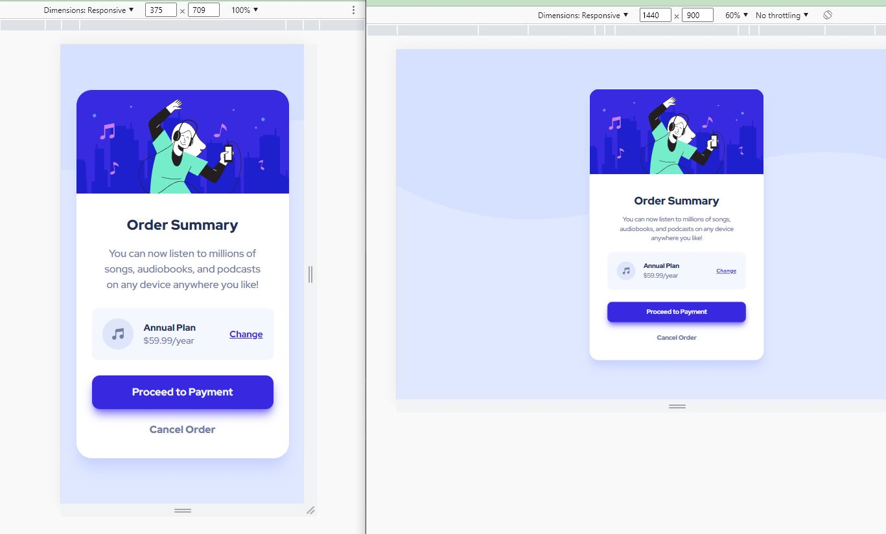

# Frontend Mentor - Order summary card solution

This is a solution to the [Order summary card challenge on Frontend Mentor](https://www.frontendmentor.io/challenges/order-summary-component-QlPmajDUj).

## Table of contents

- [Overview](#overview)
  - [The challenge](#the-challenge)
  - [Screenshot](#screenshot)
  - [Links](#links)
- [My process](#my-process)
  - [Workflow]("workflow")
  - [Built with](#built-with)
  - [What I learned](#what-i-learned)
  - [Continued development](#continued-development)
- [Author](#author)
- [Acknowledgments](#acknowledgments)

## Overview

### The challenge

Users should be able to:

- See hover states for interactive elements

### Screenshot

### Links

- Solution: [frontendmentor.io](https://www.frontendmentor.io/solutions/order-summary-component-ESfVaA-Mo3)
- Live Site: [github.io](https://siavhnz.github.io/frontendmentor/6.order-summary/index.html)

## My process

### Workflow
 - Set up the project with git
 - Install Tailwindcss
 - Create HTML Skeleton
 - Work on mobile desing
 - Work on Desktop design
 - Write README.md
 - publish on github.io
 - push to github.com
 - publish on frontendmentor.io

### Built with

- Semantic HTML5 markup
- Tailwindcss
- Flexbox

### What I learned

I worked with Flexbox grow and gap properties and became more comfortable working with Tailwindcss.

### Continued development

I need more practice on Tailwindcss and CSS layout.

## Author

- Frontend Mentor - [@siavhnz](https://www.frontendmentor.io/profile/siavhnz)

## Acknowledgments

Thanks to:

[Frontendmentor.io](https://www.frontendmentor.io/challenges) - for their Excitement challenges  

[Perfect Pixel](https://chrome.google.com/webstore/detail/perfectpixel-by-welldonec/dkaagdgjmgdmbnecmcefdhjekcoceebi?hl=en) - for such a great extension

[Tailwindcss](https://tailwindcss.com/) - for making CSS easy
